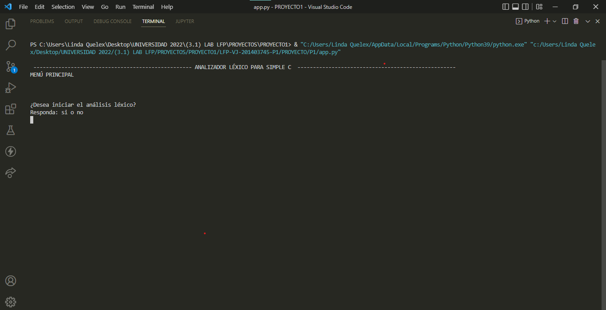
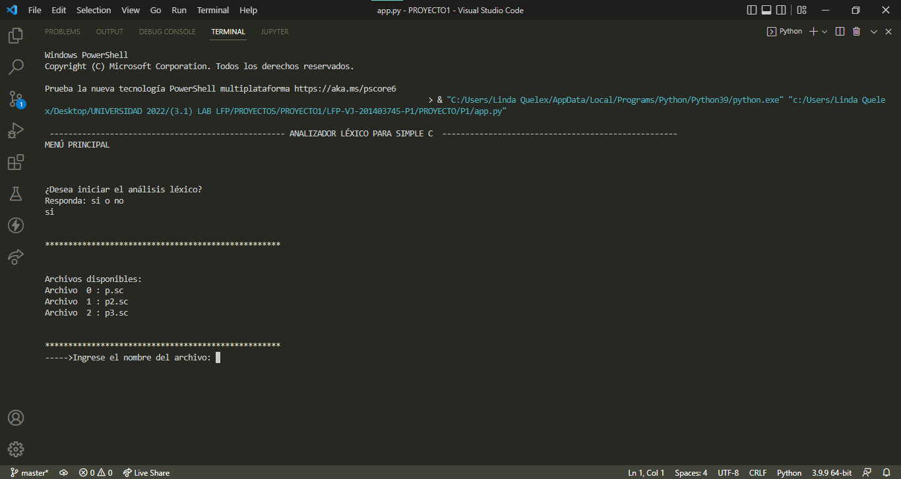
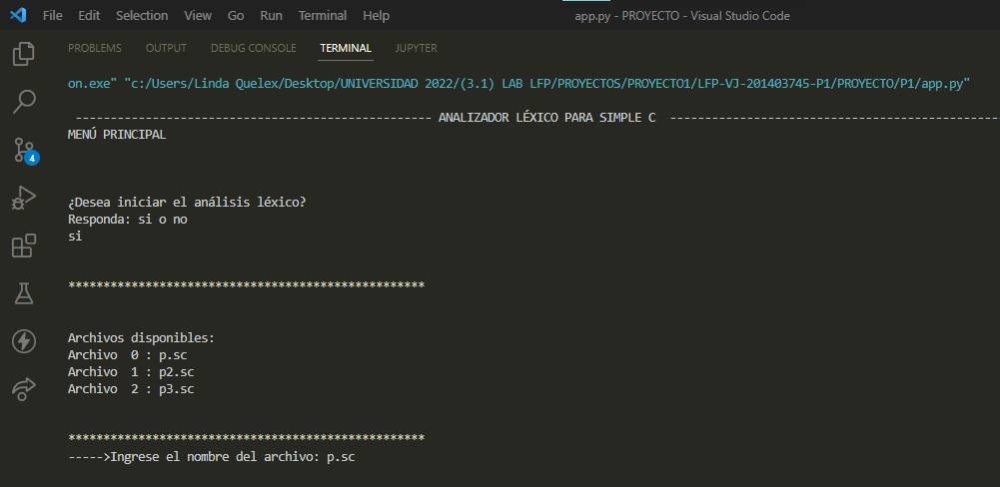
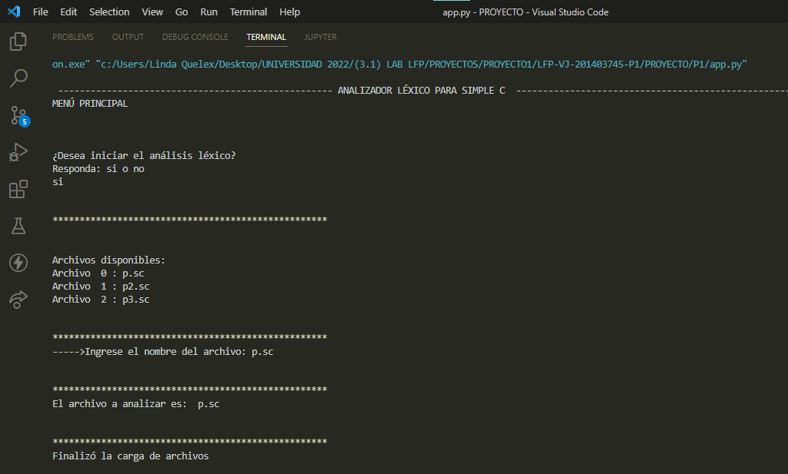
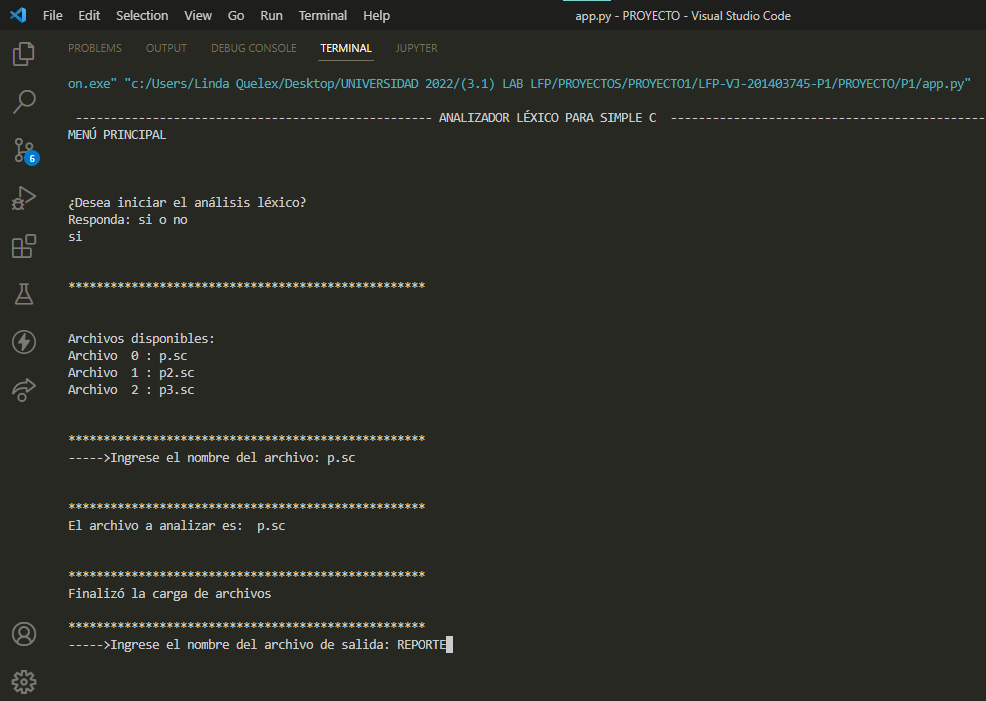
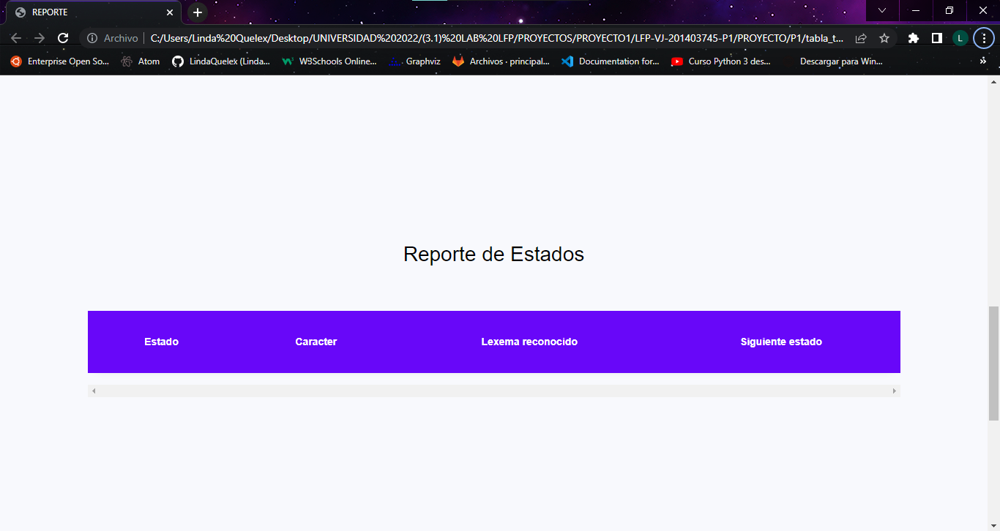
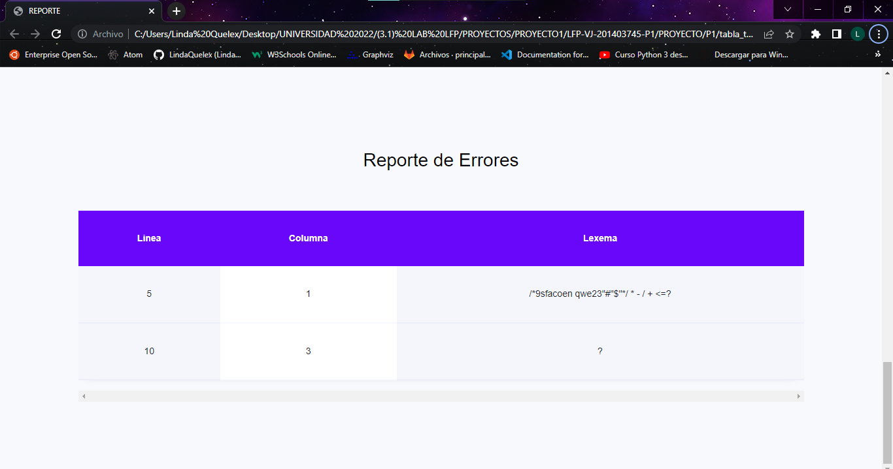
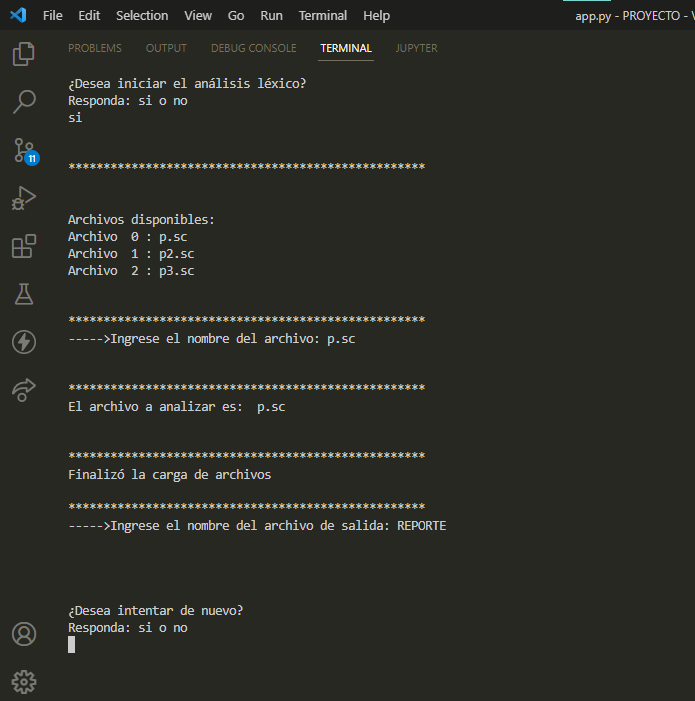
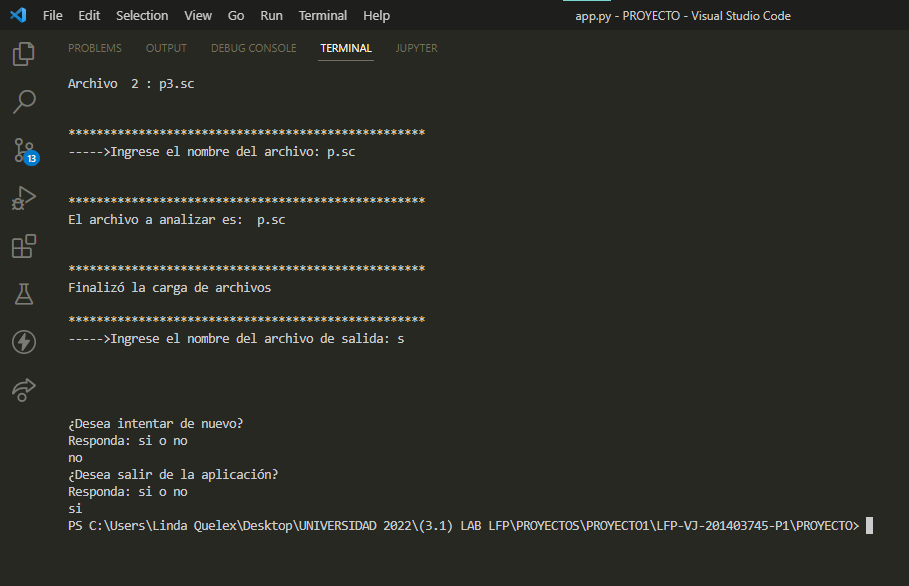

# MANUAL DE USUARIO
* UNIVERSIDAD DE SAN CARLOS DE GUATEMALA
* Proyecto 1
* Laboratorio de Lenguajes Formales de Programación 
* Linda Madelin Fabiola Quelex Sep
* 201403745

# Modo de uso del Analizador léxico
-  PASO 1: Al ejecutar la apliación se mostrará la siguiente pantalla, que pregunta si desea iniciar el analizador léxico, al cual debe ingresar "si" en minúsculas, para pasar al paso 2.

- PASO 2: Se muestran los archivos disponibles en la carpeta "ENTRADAS" que fue definida para agregar todos los archivos que se deseen analizar

- PASO 3: Ingresar el nombre del archivo a analizar, incluyendo la extensión del archivo, y presionar ENTER.

- PASO 4: El contendido del archivo se enviará al analizador léxico y se mostrará el mensaje "Finalizó la carga de archivos", como se muestra en la siguiente imagen 

- PASO 5: Se solicita ingresar el nombre del archivo de salida, el cual se mostrará en el navegador. 

  
- PASO 6: Se mostrará en el navegador como tabla 01 "Reporte de Tokens", el cual muestra, línea, columna, lexema, token y patron que identificó el analizador léxico. 

- PASO 7: Se mostrará en el navegador como tabla 02 "Reporte de Estados", el cual muestra, estado, caracter, lexema reconocido,  y siguiente estado, que identificó el analizador léxico.

- PASO 8:  Se mostrará en el navegador como tabla 02 "Reporte de Estados", el cual muestra, estado, caracter, lexema reconocido,  y siguiente estado, que identificó el analizador léxico.

- PASO 9: La aplicación de brinda la opción de inicar un nuevo proceso, el cual si responde "si", debe repertir desde el paso 1. 

- PASO 10: La aplicación de brinda la opción de inicar un nuevo proceso, el cual si responde "no", le preguntará si desea salir de la aplición, si responde "si", se cerrará la aplicación.

